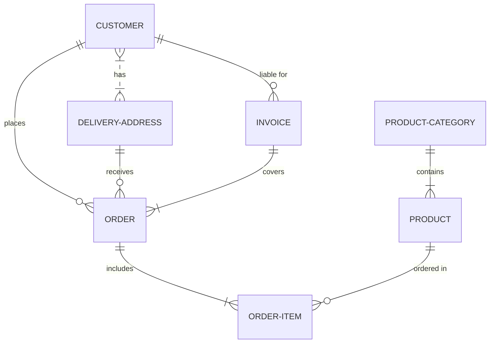

# Workflow:

- User authorizes the app on Github apps
- Once authorization + Repo scope management is done, the user is redirected to our platform with installation_id and code
    - The code is used to generate the user account and set up the login details for that user. In the mean time, the 
    - The installation_id is used to generate the installation's `access_token` which will be saved to the DB

